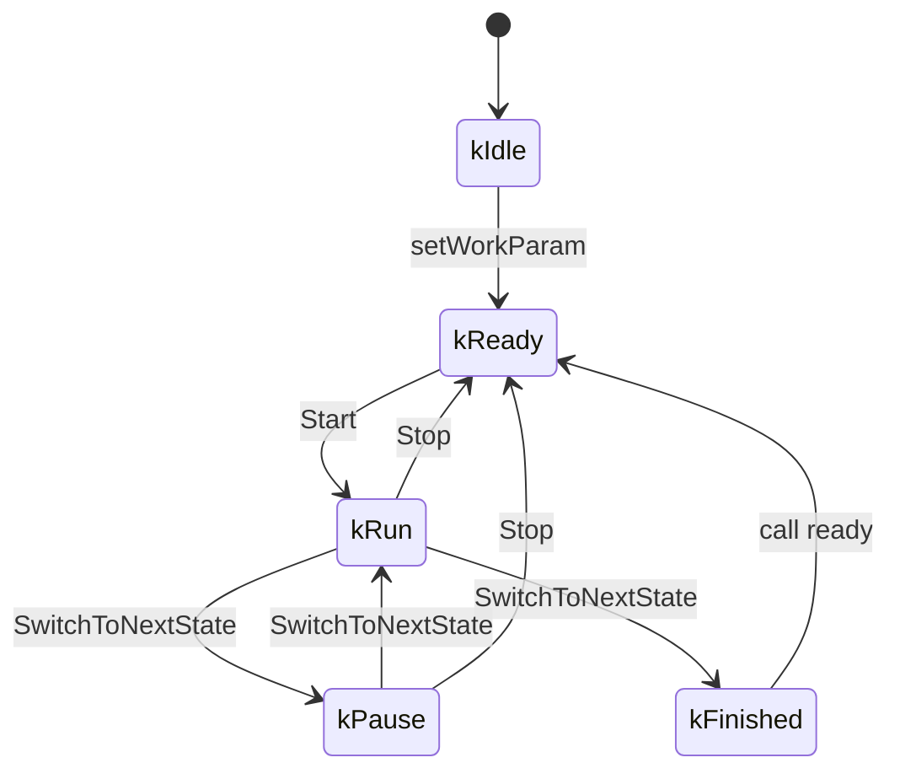

# my-switcher

一个开关组件。

## 开关状态转移图


## 特性
1. 支持设置打开特定时长；
2. 支持```运行-暂停-运行-...-运行-停止```模式运行；
3. 支持用户设置回调：
    - 运行阶段完成回调
    - 暂停阶段完成回调
    - 运行结束回调
4. 查询状态

## 示例
```cpp
#include "sdkconfig.h"
#include "freertos/FreeRTOS.h"
#include "freertos/task.h"

#include "esp_log.h"
#include "my_led.h"
#include "my_background.h"
#include "my_switcher.h"

#define TAG "MAIN"

extern "C" void app_main(void)
{
    MyLed led12(GPIO_NUM_12);
    MyLed led13(GPIO_NUM_13);

    led12.StartContinuousBlink();


    led13.EnableBrightnessAdjust(true, LEDC_CHANNEL_1, LEDC_TIMER_1);
    // led13.StartContinuousBlink(500);
    led13.SetBrightness(7);
    auto& background = MyBackground::GetInstance();
    int size=0;
    MySwitcher pomp(GPIO_NUM_9);
    pomp.SetWorkParam(2, 2, 3);
    pomp.SetRunDoneCallback([](void* arg){
        ESP_LOGE(TAG, "Pomp run done.");
    });
    pomp.SetPauseDoneCallback([](void* arg){
        ESP_LOGE(TAG, "Pomp Pause done.");
    });
    pomp.SetFinishedCallback([](void* arg){
        ESP_LOGE(TAG, "Pomp work done.");
    });
    pomp.Start();

    while(1) {
        vTaskDelay(pdMS_TO_TICKS(10*1000));
        led13.SetBrightness(0);
        led12.TurnOn();
        size++;
    }
}
```

##


